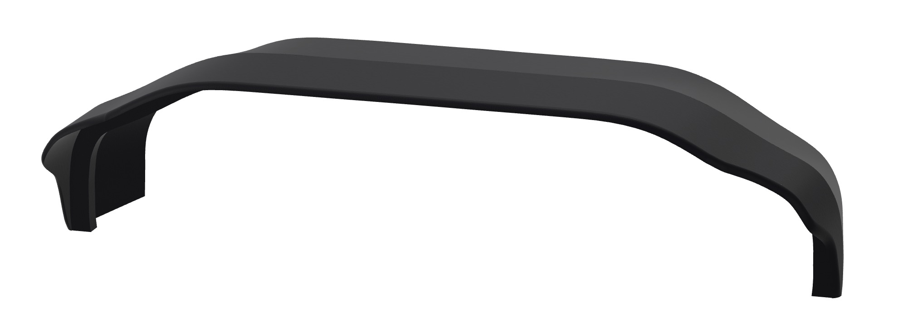

<!---
layout: page
title: "FlightSim Panels"
--->

# Welcome to FlightSim Panels

On FlightSim Panels you will find 3D models and other files related to building a flight simulation cockpit. Initially panels  provided will be geared towards an TBM 900 cockpit. 

The work on FlightSim Panels including the 3D models are licenced under a <a href="http://creativecommons.org/licenses/by-nc-sa/4.0/">Creative Commons Attribution-NonCommercial-ShareAlike 4.0 International License</a>.

## TBM 900 Panels
### [TBM 900 ECS panel](pages/ecs_panel.html)

### [TBM 900 Glareshield](pages/glareshield.html)

<!--
## Template Panel
A template for generic construction of a backlit panel. It contains two versions. One with raised text where the text can either be painted white or printed with white filament and a verson with embossed text that requires no painting at all although more complex to print.

## TBM 900 Panels
### TBM 900 Park Brake Panel
Tbm 900 park brake panel.

### TBM 900 Trilogy ESI2000 Panel

## Misc Panels
### Truck Ignition Panel
Panel made for my nephew. He is into truck simulation. This is a simple starter ignition panel. To make it simple its build with an Arduino nano that shows up as a joystick on the PC.

-->
