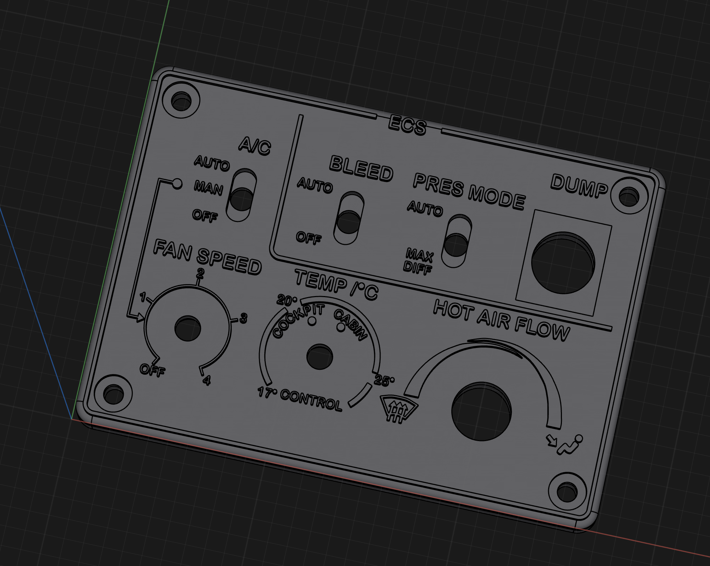

<!---
layout: page
title: "TBM 900 ECS Panel"
--->

# TBM 900 ECS Panel

This is a pretty accurate model of a TBM 900 ECS Panel. It is inspired by the work by FlightSimMaker's TBM Deice Panel available at Thingiverse

The design consist of a bottom plate and a face plate. Text and symbols are raised on the faceplate. The panel is, not yet, prepared for backlightning

It be printed in all white and painted black. By carfully sanding the top one can get the white text and symbols appear. An alternative way is to print it black and perform a filament color change on the top layers for the text to white. Below is a picture of a build panel using the later technique. It was printed on a Prusa Mini with a 0.2 nozzle.

Files suitable for 3D printing will be upload at a later stage on <https://printables.com>
