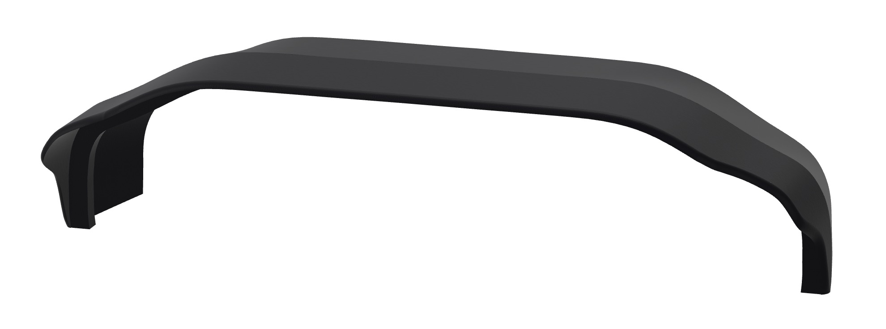
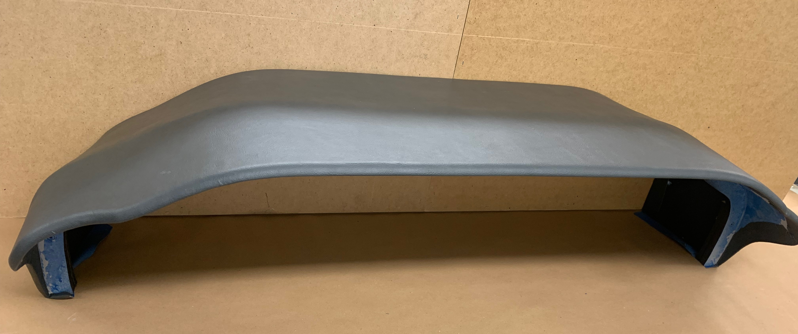

<!---
layout: page
title: "TBM 900 Glareshield"
--->

# TBM 900 Glareshield

This is a pretty accurate model of a TBM 900 glareshield. Its not as deep as the real one - only about 36 centimeter deep.

The flightsimpanels repository does provide models in both step and shapr3d format.
<https://github.com/flightsimpanels/flightsimpanels/blob/main/TBM900/Glareshield/Glareshield.step>
<https://github.com/flightsimpanels/flightsimpanels/blob/main/TBM900/Glareshield/Glareshield.shapr>

Files suitable for 3D printing will be upload at a later stage on <https://printables.com>

Below is the glareshield I built for myself. Its printed on a Prusa Mini+ in 15 parts. The parts has been glued together and the glareshield has be covered with leather imitation.

